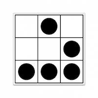

  

Demo available [here](https://borzecki.github.io/react-life/).

# Game of Life

The **Game of Life**, also known simply as **Life**, is a cellular automaton devised by the British mathematician John Horton Conway in 1970. It is a zero-player game, meaning that its evolution is determined by its initial state, requiring no further input. One interacts with the Game of Life by creating an initial configuration and observing how it evolves. It is Turing complete and can simulate a universal constructor or any other Turing machine.

## Rules

The life cellular automaton is run by placing a number of filled cells on a two-dimensional grid. Each generation then switches cells on or off depending on the state of the cells that surround it. The rules are defined as follows. All eight of the cells surrounding the current one are checked to see if they are on or not. Any cells that are on are counted, and this count is then used to determine what will happen to the current cell.

1. Death: if the count is less than 2 or greater than 3, the current cell is switched off.

2. Survival: if (a) the count is exactly 2, or (b) the count is exactly 3 and the current cell is on, the current cell is left unchanged.

3. Birth: if the current cell is off and the count is exactly 3, the current cell is switched on.

## Materials

- https://www.conwaylife.com/
- https://mathworld.wolfram.com/GameofLife.html
